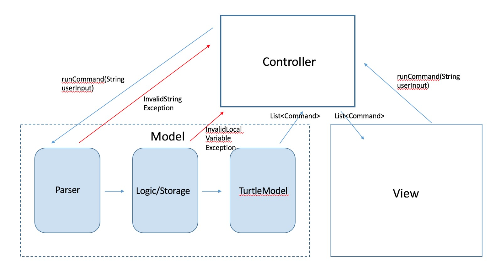
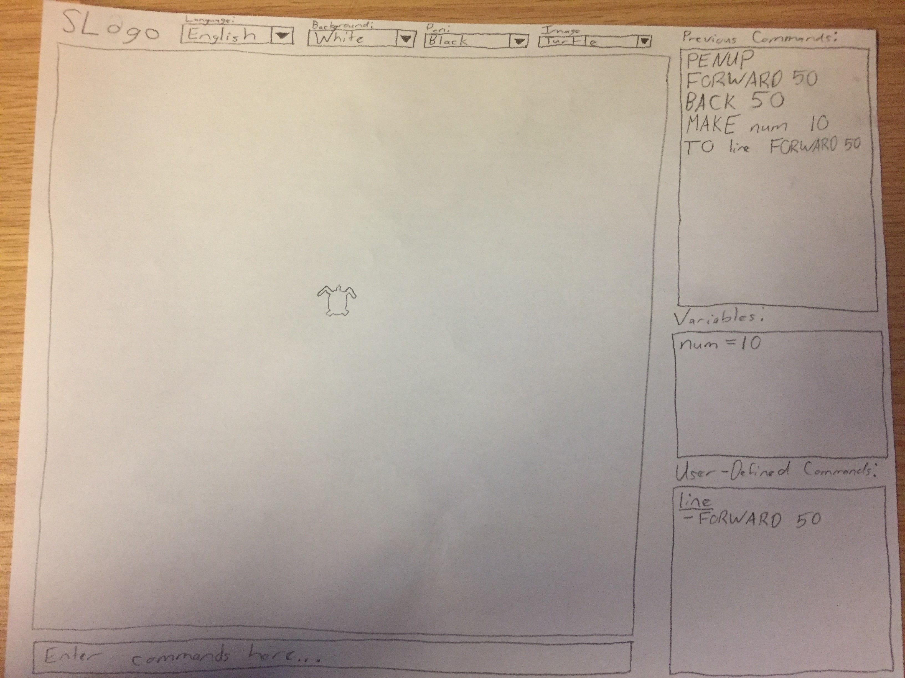

Design
=====

### Introduction
The goal of the project is to design and implement a Model-View-Controller structured program that allows a user to type in commands in a simplified Logo language to control a turtle shown on the screen. The MVC pattern will allow the user to work with the front end user interface to control the back end model such that the front end visualization updates constantly to reflect the logic changing on the back end. The basic commands to control the turtle will be open to the user and an HTML document will show valid inputs for the user, but how these methods are implemented and any intermediate methods used will be hidden to the user.

### Design Overview
The overall application will be designed using a Model-View-Controller pattern. This is done to isolate the front-end and back-end components of the application, encapsulating the logic/parsing functionality from the GUI/rendering functionality. 

##### Controller
The controller will manage data flow between the View subsystem of the application, and the Model subsystem of the application. Looking at the simplified, general plan for SLogo, the controller will call functions in the view which wait for the input string, then pass this input string to the model. The model will then return a series of front-end animations to render, which get passed back to the view. As a result, there will most likely be a SLogoController class called initially from main, which manages the relationship between the Model/View.

##### Model
External API: The model will provide an external API to the controller, for now most likely a function called runCommand. This function will receive a String containing a command, or a long String containing multiple commands inputted by the user, and then return a List of rendering directions for the View to display. 

Internal API: The model will consist of two or three smaller subsystems:
* Parser: The Parser subsystem will consist of a number of classes meant to handle the user input received from the View. The parser will scan through the user input, looking for possible input errors, and then retrieve stored variables or stored commands from the logic/storage subsystem. For example, with a command "fd x", the parser would then pass this command to logic/storage, which searches its memory for a variable named 'x'.
* Logic/Storage: The purpose of this module is to map user inputted variables to values, as well as map aliases to a series of commands. As a result, this subsystem would contain at least two maps: one for local variables, and one for stored commands. In the previous example, if x = 50, it would convert fd x to forward 50, which gets passed to the TurtleModel. This particular subsystem would expose an internal API to Parser, which allows Parser to call 'put' and 'get' functions, which store local variables and retrieve local variables.
* TurtleModel: This subsystem contains the actual location of the turtle itself, and will store information pertaining to the turtle such as its x/y coordinates, pen up/down, and its degree of rotation. This subsystem exposes an internal API, most likely consisting of a number of 'actions' the turtle can take: e.g. forward(x), rotate(y), back(x) etc. which are called from the logic/storage subsystem. When these methods are called, a series of calculations are performed in the TurtleModel subsystem to determine where the turtle should move, and then the output goes directly to the output of the runCommand() function.

##### View
External API: The view will provide a rather simple external API when compared to the Model. Currently, we're envisioning a function for throwing popup errors. The function throwError() will be called from the Controller if at any point during the Parser/Logic stage an error occurs. For example, if a user references a variable that doesn't exist, the Storage module would throw a "VariableNotInMemoryException". This exception gets caught by the controller, which then calls an API in the view which displays a popup to the user.

Additionally, the View will provide an endpoint for retrieving the resource bundle corresponding to the language in use, as well as a clearTrails() endpoint to wipe all trails currently displayed on the screen.

Probably the most important part about the external API the View will provide pertains to a function which is able to take in a list of necessary animations which the turtle will need to perform. This list is returned from the Model, but will need to be inputted into the View, which will be able to iterate through this list and display the appropriate elements on the screen.

Internal API: The view’s internal API is basically just a bunch of functions which will allow you to add stuff to the user interface. For example, there will be methods for adding Text, TextFields, Buttons, and ComboBoxes, to name a few. These methods will also return the thing that they just made allowing you to access that if you need to change it more after creating it and adding it to the Scene. That is basically all we currently have the internal view API doing, but if later extensions make us add things that this API cannot already do, we will add to it.

### User Interface
* The user will interact with the program by typing their commands into a TextField at the bottom of the screen. They will also be able to select the language, the background color, the image for the turtle, and the pen color through the use of drop-down boxes.
* The user interface will have a screen on which the turtle and pen marks will be displayed that will take up the majority of the left part of the screen. The user will be able to make the turtle move through commands entered in the TextField at the bottom of the screen. At the top of the screen, there will be ComboBoxes for language, background color, turtle image, and pen color, which will be used like a drop down menu. Along the righthand side of the screen, there will be places to view previously entered commands, variables, and user-defined commands. Finally, there will also be a Help button that will bring up an HTML page that serves as a command reference.
* An Alert box will show up whenever the user enters bad input that does not correspond to an already existing command. It will also show bad input in terms of the numbers entered for math functions (e.g., divide by 0).
* Here is a really rough sketch of what the user interface could look like:

### API Details
*All API interfaces can be accessed in the current GitLab repository.*
* Our public API includes four interfaces named `SLOGOModelExternal`, `SLOGOModelInternal`, `SLOGOViewExternal`, and `SLOGOViewInternal`.
* `SLOGOModelExternal` has the Turtle Query getters and only one other method which needs to be accessed by the front end. The query getters will return the coordinates, angle, and whether the turtle is visible or has its pen down. The other method `run(String command)` takes a string of commands passed from the view to tell the back end model what commands to execute. This string of commands will be passed through a parser that will call the internal public methods available. 
* `SLOGOModelInternal` contains all of the public methods necessary to control the turtle on the screen. This will contain all of the methods such as `forward(double pixels)`, `left(double degrees)`, `home()`, `clearScreen()`, etc. which are necessary for moving the turtle through the model and may at some point be explicitly called by the user, perhaps with a button.
* `SLOGOViewExternal` has only `showError(String errorMessage)`, `getResourceBundle()`, and `clearTrails` available externally to be called the the Model. This makes sense because the model should very rarely need to know anything about the View. The `showError` method allows the parser to alert the user on the front end that an incorrect command was entered. The `getResourceBundle` method lets the parser know what language is currently being used by the front end so that it can parse instructions in that language. The `clearTrails` method will be called by the Model when a `clearScreen` command is handled by the back end so that all visual trails in the View will be erased in preparation for a new simulation.
* `SLOGOViewInternal` contains several methods useful for adding visual features on the front end that the back end would not be worried about. This includes methods such as `addText` and `addTextField` which can be defined and modified in deeper levels of the code.

### API Example Code
##### Example Use Case Code Sequence
* *The user types 'fd 50' in the command window, and sees the turtle move in the display window leaving a trail, and the command is added to the environment's history*
	* This command would be passed as a string from the View to the Controller using the `run` method. This will parse the instruction using an expression tree and, because fd 50 is a valid command, call the Model method `forward(50)` which will move the coordinates of the turtle forward by 50. The Controller will observe this change in the Model and instruct the View to update where it displays the turtle on the screen.
##### Other Use Cases
* *The user types invalid command ‘f 50’ in the command window*
	* This will throw an `InvalidCommandInput` in the Controller which will alert then call `showError` in the view to display a string explaining the error to the user.
* *The user changes the ResourceBundle to another language in the user interface*
	* The Controller will observe this change made in the View and subsequently change which ResourceBundle it is currently using to parse instructions.

### Design Considerations
* The design decision we discussed the most was whether the parsing of the user’s input should take place in the front end or the back end. Along with this came the the decision of what the front end is passing the back end and vice versa. The pros of having the back end do it is that it goes right along with the error checking so it works out well in that sense. The cons are deciding what to pass back to the front end, whether it is a new Command, which is a new class we would create if we went this way, or if it is just the x and y coordinates of the turtle along with whether the pen is up or down, the angle the turtle is facing, and whether the turtle is showing. The pros of having it in the front end are that you already received the String from the user and you can just do it all right there. The cons are then you would have to determine what to send to the back end for error checking, for which we had no clear ideas. We ended up deciding to go with having the parsing take place in the back end and to pass a String from the front end to the back end and pass back all of the above listed information on the turtle from the the back end to the front end.
* Another design decision we spent some significant time on was whether the front end should check to see if a command is a user defined command. Originally, we figured we could just check the input against a Map of some sort. We then realized that this would not make sense because then the front end would have to check every single input to send the corresponding instructions if it was a user defined command. Since the back end is already checking every single input for parsing and error checking, we realized that this was actually the best option.

### Team Responsibilities
* Phil Foo is working on the model and will be the one who is not in charge of integrating between the model and the view.
* Harshil Garg is working on the view and will be the one who is not in charge of integrating between the model and the view.
* Addison Howenstine is working on the model and will be the one who is in charge of integrating between the model and the view.
* Noah Over is working on the view and will be the one who is in charge of integrating between the model and the view.
